# **Social Media Sentiment & Trend Analysis Platform**

[Link to Live Dashboard/App](https://sentiment-analysis-lstm-on.vercel.app/)

[Link to DagsHub Repository](https://dagshub.com/AnupamKNN/sentiment_analysis_lstm)

[Link to Presentation Video]()

[Link to LinkedIn Post]()

[Link to small dataset to test the app](https://drive.google.com/file/d/1tkglwak7iBcCBoIIur_evuyVrgbT1kED/view?usp=sharing)

[Link to large dataset to test the app](https://drive.google.com/file/d/1Ys6c39l-NLJiJarXBDyZUSPO0L7hdYXz/view?usp=sharing)


## 🏢 About the Client

**VelociSense Analytics** is a leading AI-powered social intelligence company serving enterprise customers across tourism, retail, banking, and hospitality. The organization specializes in transforming large-scale, unstructured social media data into real-time insights that drive customer experience optimization, brand reputation management, and competitor benchmarking.

With millions of posts processed daily across platforms like Twitter/X, Instagram, TripAdvisor, YouTube, and Reddit, VelociSense empowers businesses to track sentiment shifts, detect crises early, and uncover emerging trends.

The company's mission revolves around:

* Democratizing social intelligence through **real-time NLP analytics**
* Enabling organizations to respond **30% faster** to customer sentiment crises
* Providing **scalable and automated pipelines** for multi-platform data ingestion
* Delivering **predictive insights** for brand, product, and customer experience teams
* Maintaining full **GDPR-compliant**, audit-ready processing pipelines

This platform demonstrates a complete **end-to-end enterprise NLP system** designed for scalability, interpretability, and operational efficiency.

---

## 👥 Project Stakeholders & Team

| Role                                                     | Name             | Responsibility                                            |
| -------------------------------------------------------- | ---------------- | --------------------------------------------------------- |
| **Chief Marketing Officer (Executive Sponsor)**          | Rajesh Nambiar   | Budget approval, ROI validation, strategic goals          |
| **Head of Social Media Analytics (Primary Stakeholder)** | Priya Sharma     | Domain signals, KPI definition, sentiment benchmarks      |
| **Director of Customer Experience**                      | Amit Khanna      | Crisis detection requirements, customer journey alignment |
| **Project Manager**                                      | Kavya Desai      | Planning, communication, risk management                  |
| **Lead Data Scientist**                                  | **Anupam Singh** | NLP model development, methodology design, evaluation     |
| **MLOps Engineer**                                       | Ravi Patel       | CI/CD, Docker, Airflow orchestration, model deployment    |
| **Data Engineer**                                        | Sneha Gupta      | Social API ingestion, ETL, data quality                   |
| **Backend Developer**                                    | Karthik Reddy    | FastAPI, database integration, microservices              |
| **Frontend Developer**                                   | Neha Agarwal     | Streamlit dashboard, visualizations                       |
| **DevOps Engineer**                                      | Vikram Singh     | Cloud hosting, monitoring, scaling                        |
| **QA Engineer**                                          | Pooja Jain       | Testing & benchmarking                                    |
| **Compliance Manager**                                   | Aruna Krishnan   | GDPR, data privacy, audit requirements                    |
| **Business Analyst**                                     | Rohit Malhotra   | Use-case mapping, ROI analysis                            |

---

## 📉 Business Problem

Enterprises receive **massive volumes** of social media posts, reviews, and comments every day. Without a scalable, accurate, real-time sentiment system, organizations face:

* **Delayed crisis identification** → reputation damage
* **Reactive CX strategies** → customer churn
* **Manual analysis bottlenecks** → 40+ hours/week lost
* **Low accuracy from generic sentiment tools** → poor decisions
* **No competitor trend monitoring** → strategic blind spots

The goal is to build a **scientifically validated, production-grade NLP platform** that converts noisy social data into actionable insights at scale.

---

## 🎯 Project Objectives

* Build a **high-accuracy sentiment analysis pipeline** with >80% F1-score on enterprise datasets
* Develop a **systematic comparison framework** across preprocessing, embeddings, and models
* Deliver a **scalable FastAPI-based inference service** with <200ms latency
* Implement complete **MLOps automation** for retraining, deployment, and monitoring
* Provide a **Streamlit dashboard** for real-time sentiment intelligence
* Ensure full **GDPR compliance**, encryption, and secure data handling

---

## 🧰 Tech Stack

| Category                   | Tools & Technologies                                                         |
| -------------------------- | ---------------------------------------------------------------------------- |
| **Language**               | Python 3.11                                                                  |
| **NLP Libraries**          | Tensorflow, spaCy, NLTK, Gensim                                              |
| **Embeddings & Models**    | TF-IDF, Word2Vec, GloVe, FastText, LSTM, BiLSTM, CNN + LSTM, LSTM + Attention, Transformers     |
| **Hyperparameter Tuning**  | Optuna,                                                                      |
| **Data Processing**        | Pandas, NumPy                                                                |
| **MLOps**                  | MLflow (tracking), DVC (versioning), Docker, GitHub Actions                  |
| **Workflow Orchestration** | Apache (Astro) Airflow                                                       |
| **ModelServing**           | FastAPI + Uvicorn                                                            |
| **Dashboard (frontend)**   | React, Node.js, Tailwind                                                     |
| **Datasource**             | Kagglehub                                                                    |
| **Deployment**             | Docker, GitHub Container Registry (GHCR)                                     |

---

## 🖥️ Platform Features

* **📥 Real-time Post Ingestion** via Airflow DAGs
* **🧹 Systematic preprocessing pipeline** with configurable cleaning and normalization
* **🤖 Sentiment Model Server** with scalable FastAPI endpoint
* **📊 Real-time Dashboard** for sentiment trends, volume spikes, top positive/negative posts
* **🧪 Fully versioned models & data** with DVC + MLflow

---

## ⚙️ Setup & Run

### Option 1 — Run with Docker (Recommended)

**Prerequisites:** Docker Desktop installed.

**Pull image from GHCR:**

```bash
docker pull ghcr.io/anupamknn/sentiment_analysis_lstm:latest
```

**Or build locally:**

```bash
git clone https://github.com/AnupamKNN/sentiment_analysis_lstm.git
cd sentiment_analysis_lstm
docker build -t sentiment_analysis_lstm:latest .
```

**Run the container:**

```bash
docker run -p 8000:8000 sentiment_analysis_lstm:latest
```

Access FastAPI Dashboard at:
[http://localhost:8000/docs](http://localhost:8000/docs)

---

### Option 2 — Manual Local Setup

#### 1️⃣ Clone Repo

```bash
git clone https://github.com/AnupamKNN/sentiment_analysis_lstm.git
cd sentiment_analysis_lstm
```

#### 2️⃣ Create & Activate Virtual Environment

```bash
python3.11 -m venv venv
source venv/bin/activate  # Linux/Mac
.\venv\Scripts\activate   # Windows
```

#### 3️⃣ Install Dependencies

```bash
pip install -r requirements.txt
```

#### 4️⃣ Configure Environment

Copy example file:

```bash
cp .env.example .env
```

Set values for:

* `MLFLOW_TRACKING_URI`
* `MLFLOW_TRACKING_USERNAME`,
* `MLFLOW_TRACKING_PASSWORD`

#### 5️⃣ Start App

To access the backend, which serves the model to the frontend via Fast API

```bash
python app.py
```

To access the frontend to which the model is being served, click on the "Link to Live Dashboard/App"

---

## 🔬 Model Development & Methodology

The project uses a **scientific methodology** to compare every major NLP approach:

### 1. **Text Preprocessing Techniques**

* URL, emoji, punctuation removal
* Stemming vs Lemmatization
* Tokenization: word/subword/byte-level
* Stopword removal strategies

### 2. **Feature Engineering Approaches**

* Bag of Words
* TF-IDF (1–3 grams)
* Word2Vec, GloVe, FastText
* Doc2Vec
* Transformer embeddings

### 3. **Model Architectures Compared**

* Logistic Regression, SVM, RandomForest (baseline models)
* LSTM
* Bidirectional LSTM
* LSTM + Attention
* CNN-LSTM Hybrid
* Transformer-Style Self Attention

### 4. **Evaluation Metrics**

* F1-score (macro, weighted)
* Precision / Recall
* ROC-AUC
* Inference latency
* Model size & scalability

All experiments are tracked in **MLflow** and datasets/models are versioned using **DVC**.

---

## 🧪 Latest Training Result (Integrated)

**Run timestamp:** `2025-11-22T13:27:59.215056`
**Model:** `lstm_attention_model`

**Evaluation metrics (test set):**

* **F1-score:** `0.8393625`
* **Precision:** `0.8382322405960083`
* **Recall:** `0.8410333333333333`
* **Accuracy:** `0.8396304507884742`
* **ROC-AUC:** `0.9192007208333334`

**Confusion matrix (format: [[TN, FP], [FN, TP]]):**

```
[[100523, 19477],
 [19076, 100924]]
```

**Raw counts (TN / FP / FN / TP):** `100523, 19477, 19076, 100924`

> This `lstm_attention_model` surpasses the project F1 target (>80%) and demonstrates strong discrimination (ROC-AUC ≈ 0.919). These results represent the current production candidate.

---

## 🧪 Model Performance Summary (Updated)

### Baseline

| Metric   | Value (baseline) |
| -------- | ---------------- |
| F1-score | 65%              |
| Accuracy | 70%              |
| Latency  | 220–300 ms       |

### Final (Current Production Candidate — `lstm_attention_model`)

| Metric           | Value                                |
| ---------------- | ------------------------------------ |
| F1-score         | **83.94%**                           |
| Precision        | **83.82%**                           |
| Recall           | **84.10%**                           |
| Accuracy         | **83.96%**                           |
| ROC-AUC          | **91.92%**                           |
| Confusion Matrix | `[[100523, 19477], [19076, 100924]]` |

**Operational targets met:**

* F1-score target (>80%) — **achieved**
* Inference latency target (<200 ms) — *ensure serving infra meets this in production*
* Scalability target (100K+ predictions/hr) — *validate throughput on deployment*

**Final artifacts (production candidate):**

* `final_models/lstm_attention_model.keras`
* `final_models/preprocessor.pkl`
* MLflow run: `run_id` stored in experiment tracking (see MLflow UI)

---

## 🏭 Production Pipeline (MLOps)

| Script                 | Purpose                                              |
| ---------------------- | ---------------------------------------------------- |
| `data_ingestion/`      | API scraping + Airflow DAGs                          |
| `data_processing/`     | Cleaning, normalization, tokenization                |
| `feature_engineering/` | TF-IDF, embeddings, vectors                          |
| `model_training/`      | Experiments, tuning, MLflow logging                  |
| `model_evaluation/`    | Metrics, confusion matrices                          |
| `model_serving/`       | FastAPI microservice (deploy `lstm_attention_model`) |
| `monitoring/`          | Drift detection, latency tracking                    |

**Pipeline Flow:**

```mermaid
flowchart LR
    A[📥 Ingest Social Data] -->
    B[🧹 Preprocess & Clean] -->
    C[⚙️ Feature Engineering] -->
    D[🤖 Train & Compare Models] -->
    E[🧪 Evaluate & Select Best] -->
    F[🚀 Deploy Model via FastAPI] -->
    G[📊 Monitor & Retrain]
```



---

## 🔥 Results & Business Insights (Updated)

* **Improved crisis detection** and classification with F1 ≈ **0.84**, leading to higher confidence in automated alerts
* **High ROC-AUC (0.919)** indicates robust separation between positive and negative classes — fewer false positives/negatives in critical scenarios
* **Operational impact**: more accurate routing of negative posts to priority support queues; better campaign performance signals
* **Data-driven prioritization**: able to focus human review on borderline / high-impact cases using model confidence + LLM summarization

---

## 📈 Business Impact (Projected)

| Metric                    | Outcome                                   |
| ------------------------- | ----------------------------------------- |
| Crisis Response Time      | **↓30%** (improved by reliable detection) |
| CX Operational Efficiency | **↑40%**                                  |
| Manual Workload           | **↓50–70%**                               |
| Sentiment Accuracy        | **↑ ~19%** (from baseline to final model) |
| Data Processing Capacity  | **1M+ posts/day** (pipeline target)       |

---

## ✅ Final Deliverables

| Deliverable                           | Description                                                                               |
| ------------------------------------- | ----------------------------------------------------------------------------------------- |
| 📦 **NLP Experiment Framework**       | All comparisons documented & reproducible                                                 |
| 🧠 **Production-Optimized NLP Model** | `lstm_attention_model` (final candidate) + preprocessing pipeline                         |
| 🧮 **Versioned Artifacts**            | Logged & stored using DVC + MLflow                                                        |
| 🖥️ **React + Node.js + Tailwind Dashboard** | Real-time sentiment monitoring                                                      |
| 🔧 **Full MLOps System**              | Airflow, FastAPI, CI/CD, Docker                                                           |
| 🗂️ **Technical Documentation**       | Architecture, API specs, model reports (includes training run details & confusion matrix) |


---

## 💡 Enjoyed this project?

If this repository helped you, consider:

* ⭐ **Starring the repo**
* 🍴 **Forking it**
* 🐛 **Opening issues** or feature requests

---

### Notes & Conventions

* **Timezone:** UTC for ingestion timestamps
* **Security:** API keys must remain in `.env`
* **Compliance:** All pipelines are GDPR-ready
* **Reproducibility:** Full version tracking via DVC + MLflow
* **Latest training log snippet:**

Here is your log converted into a clean, readable **Markdown table**:

### **Training Result Table**

| Timestamp                  | Model                | F1-score  | Precision          | Recall             | Accuracy           | ROC-AUC            | TN     | FP    | FN    | TP     | Confusion Matrix                     |
| -------------------------- | -------------------- | --------- | ------------------ | ------------------ | ------------------ | ------------------ | ------ | ----- | ----- | ------ | ------------------------------------ |
| 2025-11-22T13:27:59.215056 | lstm_attention_model | 0.8393625 | 0.8382322405960083 | 0.8410333333333333 | 0.8396304507884742 | 0.9192007208333334 | 100523 | 19477 | 19076 | 100924 | `[[100523, 19477], [19076, 100924]]` |

Let me know if you want an alternate layout (e.g., split confusion matrix into separate rows, or highlight best values).


[](https://github.com/anupamknn/sentiment_analysis_lstm)
